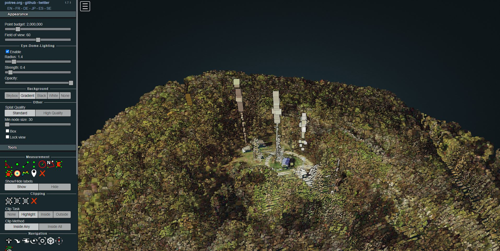

# Welcome to Black Mountain!

## Introduction

Black Mountain is the highest peak located in Kentucky and is located near the Virginia Border, in Harlan County, KY. The summit is located at 4,145ft above sea level and can be reached by a hiking route that is popular amongst tourists. When the weather permits, you are also able to see a scenic view of the Smokey Mountains near Tennessee and North Carolina.

## Black Mountain Overlook

This is an overlook view of the radio tower that is located near the summit of Black Mountain. There is also a summit plaque that details information about the summit and also gives credit towards a WWII Veteran that helped create one of the first cable systems in the United States.

## Video of Black Mountain

A short chip of "flying" around Black Mountain that can be seen with the link below.

[Link to Video](https://youtu.be/J0KL63oRgEU)

      
    

    

## Potree of Black Mountain

This 3D interactive map gives you the ability to fly around Black Mountain and see the aerial mapping that can be done.

[Link to Potree](https://apa299.github.io/blkmn/potreeBM/)

## Additional Photos

**Plaque Description**

*Plaque commemorating WWII Veteran that created one of the first cable systems in the United States and also gives information about the summit as well*

**Evening View of Black Mountain**

*Scenic View of Black Mountain in the evening that captures the beauty that can be noticed from above.*

